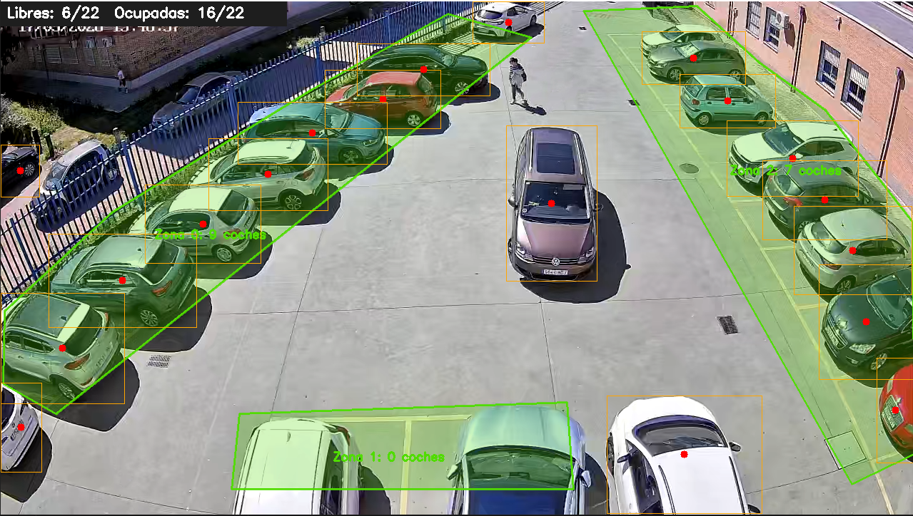

# Detector de Aparcamiento con Visión Artificial

Sistema de detección de plazas libres/ocupadas en aparcamientos mediante cámara de vigilancia, YOLOv8 y bot de Telegram.

---

## Cómo funciona

```
marcar_plazas.py  →  spots.json  →  detector_yolo.py  →  bot_telegram.py
  (dibujar ROIs)     (zonas)        (detectar + contar)   (responder por Telegram)
```

1. **`marcar_plazas.py`**: se ejecuta una sola vez para dibujar polígonos (zonas ROI) sobre una captura del aparcamiento. Guarda las zonas en `imgs/spots.json`.
2. **`detector_yolo.py`**: carga las zonas y analiza una imagen con YOLOv8. Calcula `Libres = NUM_PLAZAS − coches_detectados` y guarda el resultado en `imgs/estado_actual.json`.
3. **`bot_telegram.py`**: bot de Telegram que, al recibir `/estado`, ejecuta la detección en tiempo real sobre `imgs/1.png` y responde con las plazas libres y la hora.

La detección usa **YOLOv8n** (nano). Cualquier objeto que solape con una zona ROI cuenta como plaza ocupada — se comprueba el solapamiento completo del bbox, no solo el centro.

---

## Requisitos

- Python 3.8+
- Entorno virtual recomendado

```bash
python -m venv venv
venv\Scripts\activate        # Windows
# source venv/bin/activate   # Linux/Mac
```

```bash
pip install ultralytics opencv-python numpy python-telegram-bot python-dotenv
```

El modelo `yolov8n.pt` se descarga automáticamente la primera vez.

---

## Estructura de archivos

```
aparcamiento/
├── marcar_plazas.py          # Herramienta para marcar zonas ROI
├── detector_yolo.py          # Detector principal (imagen)
├── bot_telegram.py           # Bot de Telegram
├── .env                      # Token del bot (no subir al repositorio)
├── .gitignore
├── yolov8n.pt                # Modelo YOLOv8 nano (se descarga automáticamente)
└── imgs/
    ├── 1.png                 # Imagen del aparcamiento que analiza el bot
    ├── spots.json            # Zonas ROI guardadas
    ├── estado_actual.json    # Estado más reciente (generado automáticamente)
    └── capturas/             # Capturas históricas (generadas con G)
        ├── captura_YYYYMMDD_HHMMSS.png
        └── estado_YYYYMMDD_HHMMSS.json
```

---

## Paso 1 — Marcar las zonas ROI

Coloca una captura del aparcamiento en `imgs/1.png` y ejecuta:

```bash
python marcar_plazas.py
```

### Controles

| Acción | Resultado |
|--------|-----------|
| Clic izquierdo | Añadir vértice al polígono |
| Doble clic | Cerrar zona (mínimo 3 puntos) |
| `U` | Deshacer último punto o última zona |
| `C` | Cancelar zona en curso |
| `S` | Guardar `spots.json` |
| `Q` / `ESC` | Salir (pregunta si guardar) |

Cada zona representa un **grupo de plazas**. El total de plazas se configura con `NUM_PLAZAS` en `detector_yolo.py`.

---

## Paso 2 — Ejecutar el detector (imagen estática)

```bash
python detector_yolo.py --fuente imgs/1.png
```

### Opciones

| Argumento | Por defecto | Descripción |
|-----------|-------------|-------------|
| `--fuente` | `0` | Ruta a la imagen |
| `--conf` | `0.30` | Confianza mínima YOLO (0.0 – 1.0) |
| `--visual` | off | Guardar imagen anotada en `imgs/capturas/` |
| `--spots` | `imgs/spots.json` | Ruta al archivo de zonas |

Al ejecutar, genera automáticamente `imgs/estado_actual.json` con el resultado.

---

## Paso 3 — Bot de Telegram

### Configuración

Crea el fichero `.env` en la raíz del proyecto:

```
TELEGRAM_TOKEN=tu_token_aqui
```

Obtén el token creando un bot con [@BotFather](https://t.me/BotFather) en Telegram.

### Arrancar el bot

```bash
python bot_telegram.py
```

### Comandos disponibles

| Comando | Acción |
|---------|--------|
| `/start` | Mensaje de bienvenida |
| `/estado` | Analiza `imgs/1.png` y devuelve plazas libres/ocupadas |
| `/plazas` | Igual que `/estado` |
| Cualquier texto | Igual que `/estado` |

### Ejemplo de respuesta

```
🟢 Hay 9 plazas libres de 22.
🔴 Ocupadas: 13/22
⏱ Actualizado: 17:42:05
```

El bot muestra "🔍 Analizando aparcamiento..." mientras ejecuta YOLO y luego edita el mensaje con el resultado.

---

## Configuración principal (`detector_yolo.py`)

```python
NUM_PLAZAS  = 22      # Total de plazas del aparcamiento
CONF_UMBRAL = 0.30    # Confianza mínima YOLO
```

```
Libres   = NUM_PLAZAS − objetos detectados en zonas ROI
Ocupadas = NUM_PLAZAS − Libres
```

---

## Formato de `spots.json`

```json
[
  {
    "id": 0,
    "points": [[120, 80], [450, 75], [480, 420], [100, 430]]
  },
  {
    "id": 1,
    "points": [[820, 60], [1100, 55], [1120, 380], [840, 390]]
  }
]
```

---

## Formato de `estado_actual.json`

```json
{
  "timestamp": "2026-03-17T17:42:05",
  "total_plazas": 22,
  "libres": 9,
  "ocupadas": 13,
  "zonas": [
    { "id": 0, "coches_dentro": 5 },
    { "id": 1, "coches_dentro": 4 },
    { "id": 2, "coches_dentro": 4 }
  ]
}
```

---

## Mejoras posibles

### Detección

| Mejora | Descripción |
|--------|-------------|
| **Suavizado temporal** | Marcar una plaza ocupada solo si lleva N análisis consecutivos con coche, evitando falsos positivos por coches en movimiento o sombras |
| **Umbral de solapamiento** | Exigir que al menos el X% del bbox esté dentro de la zona (ej. 30%), no solo un píxel de contacto |
| **Filtro por clase COCO** | Ignorar personas, bicicletas o bolsas usando las clases COCO (2=car, 3=moto, 5=bus, 7=truck) |
| **Zona de pasillo/exclusión** | Marcar zonas que se excluyen del conteo para ignorar el carril de circulación |
| **Modelo más preciso** | Cambiar `yolov8n.pt` → `yolov8s.pt` o `yolov8m.pt` para mejor detección a costa de más CPU/tiempo |
| **Imagen desde cámara IP** | Reemplazar `imgs/1.png` por un frame capturado en tiempo real de una cámara RTSP |

### Bot de Telegram

| Mejora | Descripción |
|--------|-------------|
| **Avisos automáticos** | Notificar a los suscriptores cuando el aparcamiento se llena o vuelve a tener plazas |
| **Foto adjunta** | Enviar la imagen anotada junto al mensaje de estado (`--visual`) |
| **Actualización periódica** | Actualizar `imgs/1.png` automáticamente desde una cámara cada N minutos |
| **Lista de usuarios** | Guardar qué usuarios han hecho `/start` para enviarles alertas |
| **Comando `/foto`** | Devolver la última captura anotada guardada en `imgs/capturas/` |

### Infraestructura

| Mejora | Descripción |
|--------|-------------|
| **Histórico CSV/SQLite** | Registrar el estado cada N minutos para graficar la ocupación a lo largo del día |
| **Panel web** | Dashboard con la imagen en vivo y gráfica de ocupación (Flask + Chart.js) |
| **API REST** | Endpoint `/api/estado` que devuelve el JSON para integrarlo con otros sistemas |
| **Despliegue como servicio** | Ejecutar el bot como servicio de Windows (`sc create`) o systemd en Linux |

---

## Ejemplo de salida del detector

```
▸ Modo IMAGEN: imgs/1.png
  → 12 objetos detectados
✓ JSON guardado: estado_20260317_174205.json
  🟢 Libres: 9   🔴 Ocupadas: 13
  Zona  0  Coches dentro: 5
  Zona  1  Coches dentro: 4
  Zona  2  Coches dentro: 4
```


---

## Créditos

Desarrollado para el **IES Gran Capitán** como proyecto de visión artificial aplicada a gestión de aparcamientos.

Tecnologías: [YOLOv8 (Ultralytics)](https://github.com/ultralytics/ultralytics) · OpenCV · NumPy · python-telegram-bot · Python